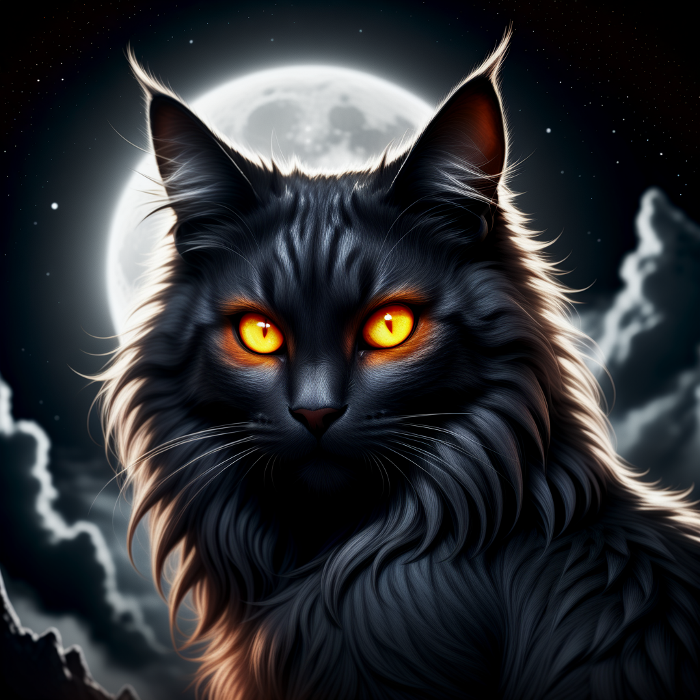
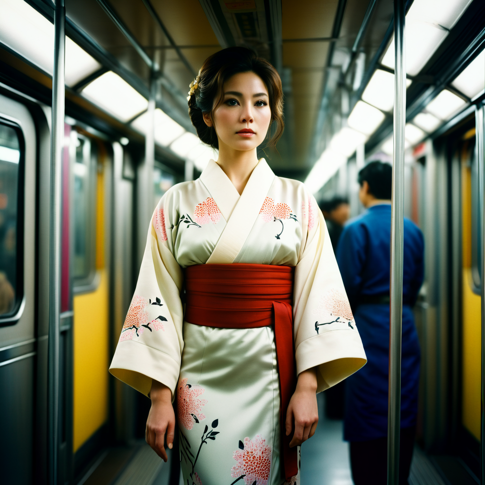

# PROMPATHON: Compare Your Prompts with AI

Welcome to the **PROMPATHON** project where you can compare your prompts with AI, using OpenDalleV1.1 for image generation and all-MiniLM-L6-v2 for accuracy evaluation.

---

## Overview

This Streamlit app allows users to enter various prompts to generate images using OpenDalleV1.1 and check the accuracy of their prompts using Hugging Face's `all-MiniLM-L6-v2` model. It provides a fun and interactive way to compare different prompts across three rounds and calculate a final accuracy score.

### Key Features:
- **Image Generation:** Using OpenDalleV1.1 based on the user's input prompt.
- **Accuracy Checking:** Evaluate how well your prompt matches predefined sample sentences in terms of similarity using `all-MiniLM-L6-v2`.
- **Round-based Progression:** Three rounds of prompts where users can see image generation results and accuracy scores.
- **Final Score:** Calculate and display an overall accuracy score based on all three rounds.

---

## How It Works

1. **Round 1:**
   - Enter a prompt related to a **VR headset** scenario.
   - AI will generate an image based on your prompt.
   - Your prompt's accuracy is compared with a predefined sentence and shown as a similarity score.

2. **Round 2:**
   - Enter a prompt related to a **drone** in a rainforest.
   - Image generation and accuracy scoring are done similarly to Round 1.

3. **Round 3:**
   - Enter a prompt about a **quantum computer**.
   - Your generated image and accuracy score are provided.

4. **Final Accuracy:**
   - After completing all three rounds, a final score is calculated based on the individual round scores.

---

## Requirements

- Python 3.x
- Streamlit
- Requests library for API communication

Make sure to store your **Hugging Face API token** as a secret in Streamlit (`st.secrets['auth_token']`).

---

## Setup Instructions

1. **Clone this repository**:
   ```bash
   git clone https://github.com/yourusername/prompathon
   cd prompathon
   ```

2. **Install dependencies**:
   Ensure you have the necessary libraries installed:
   ```bash
   pip install -r requirements.txt
   ```

3. **Streamlit configuration**:
   You will need a **Hugging Face API token** for accessing the models. Store it in your Streamlit app secrets as:
   ```python
   st.secrets['auth_token'] = 'your_huggingface_api_token'
   ```

4. **Run the app**:
   To launch the Streamlit app, run:
   ```bash
   streamlit run app.py
   ```

---

## How to Use the App

1. **Enter Prompts:** 
   - For each round, enter a creative prompt (e.g., about VR, drones, or quantum computers).
   
2. **View Generated Images:**
   - The AI will generate an image based on your prompt.
   
3. **View Accuracy Score:**
   - The app will compare your prompt with predefined sample sentences and show the accuracy score.

4. **Final Score:**
   - After completing all rounds, the app will calculate your final accuracy score, which is based on your performance across all three rounds.

---

## Demo

Below are examples of prompts and images generated:

### Example 1: 
**Prompt:**
```
black fluffy gorgeous dangerous cat animal creature, large orange eyes, big fluffy ears, piercing gaze, full moon, dark ambiance, best quality, extremely detailed
```
**Image:**


### Example 2:
**Prompt:**
```
cinematic film still of Kodak Motion Picture Film: (Sharp Detailed Image) An Oscar-winning movie for Best Cinematography, a woman in a kimono standing on a subway train in Japan, Kodak Motion Picture Film Style, shallow depth of field, vignette, highly detailed
```
**Image:**


---

## Contributing

We welcome contributions! Feel free to open an issue or submit a pull request for any improvements or new features.

---

## License

This project is licensed under the MIT License.

---

## Acknowledgments

- **OpenDalleV1.1** for image generation.
- **Hugging Face's `all-MiniLM-L6-v2`** for text similarity.
- Streamlit for creating the interactive interface.

---

Happy experimenting with AI!
